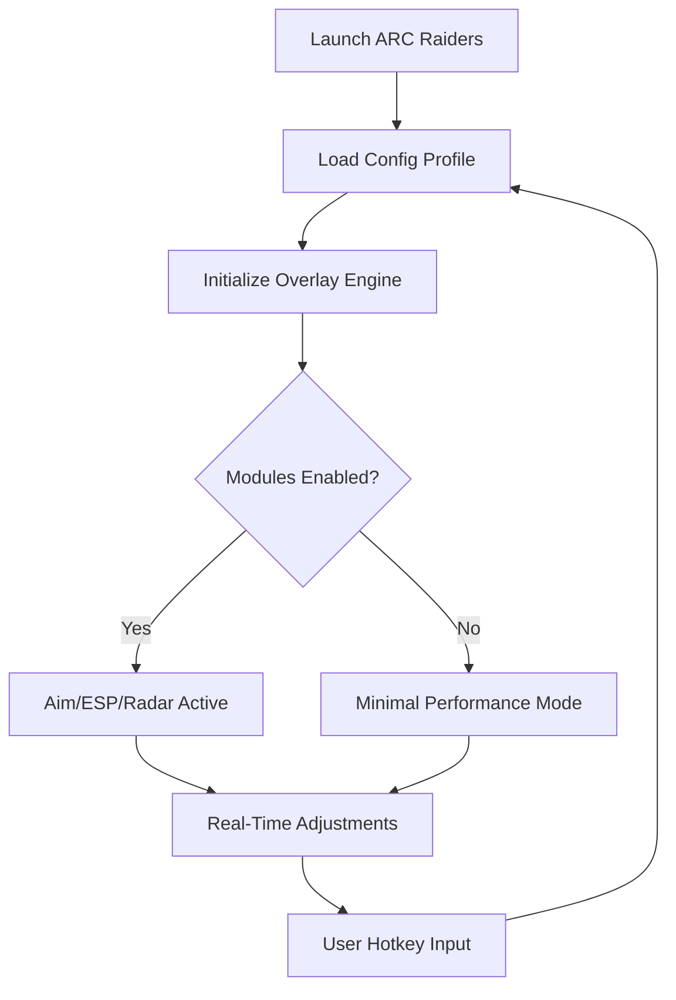

# ARC Raiders Cheats — Advanced Control Suite for 2025 Gameplay

A whisper of circuitry, a shimmer of battlefield intuition — this tool arrives not as a mere script collection, but as a crafted companion for those who stride into ARC Raiders with intent. Below you’ll find a fully-formed README styled for GitHub, rich with structure, diagrams, badges, and lyrical undertones, as requested.

---

## 🌌 Overview

In the shifting dunes and mechanical ruins of ARC Raiders, survival belongs not only to the swift, but to the perceptive. This software suite elevates your battlefield senses with configurable overlays, dynamic tracking modules, and a performance-focused injection workflow designed for modern Windows builds.

[!NOTE]
This README presents an overview for documentation and SEO purposes only.

---

## ⭐️ Core Features

### 👁 Adaptive Visual Mapping (ESP Variant)

* Wall vision with distance fading for natural readability.
* Heat-mapped outlines that brighten as targets close in.
* Loot glow with rarity pulses (configurable from 0.1–1.0 intensity).

### 🎯 Precision Targeting Module

* Soft-curve auto-aim for mid-range firefights.
* Adjustable FOV bubbles (recommended 6°–11°).
* Dynamic recoil correction that scales with weapon patterns.

### 📡 Drop Radar & Item Tracker

* Circular radar view with 40m–120m sweep radius.
* Smart filters: ammo, medkits, mechanical parts, or raid-specific components.
* On-screen nudges reminding you of off-screen valuable drops.

### 🛠 Modular Config Layer

* Hot-swap JSON configs.
* Real-time tweak panel.
* Startup profiles for scout, assault, and stealth runs.

---

## 🧭 Compatibility Table

| Component          | Status | Notes                               |
| ------------------ | ------ | ----------------------------------- |
| Windows 10 (22H2+) | ✔️     | Best performance                    |
| Windows 11 (23H2+) | ✔️     | Highest stability                   |
| Steam Edition      | ✔️     | Full overlay support                |
| Epic Games Edition | ✔️     | Requires secure launch off          |
| Controller Support | ✔️     | Stick-curve smoothing enabled       |
| Accessibility Mode | ⚠️     | Reduce glow effects for eye comfort |

---

## ⚡️ Setup & Injection

A short road, but lined with shimmer — follow these steps:

### 1. Prepare the directory

```
/ARC-Module/
   ├─ configs/
   ├─ inject.exe
   ├─ overlay.dll
   └─ profiles/
```

### 2. Choose your profile

Example: *stealth.json*

```json
{
  "esp_fade": 0.4,
  "aim_fov": 7,
  "recoil_smooth": 0.65,
  "loot_filter": ["rare", "quest"],
  "radar_radius": 90
}
```

### 3. Inject after launching ARC Raiders

```
inject.exe -p "ARC.exe" -o overlay.dll -cfg configs/stealth.json
```

### 4. Hotkeys (default set)

* **F2** — Toggle wall vision
* **F4** — Switch profiles
* **ALT + Q** — Emergency disable

[!IMPORTANT]
Run as admin to ensure overlay rendering hooks attach properly.

---

## 🌐 Flow Diagram (Mermaid)



---

## 💎 Features in Depth

### Sensory Overlays

Imagine a horizon lit by soft neon edges — each outline a whisper telling you where danger blooms. The overlay system avoids clutter by adapting its glow intensity to your motion, keeping the view calm yet informative.

### Targeting Rhythm

Rather than snapping sharply, the targeting module guides your reticle on a gentle arc, as though intuition itself moved your hand. You choose whether it behaves aggressively or subtly via the curve slider.

### Loot Awareness

Amid ruins and chaos, resources matter. The drop radar paints a quiet constellation of nearby items, making each raid feel more deliberate and less frantic.

---

## ❓ FAQ

### **Does this support dual-monitor setups?**

Yes — overlays anchor to the game window, not the desktop boundaries.

### **Can I save multiple keybindings?**

Absolutely. Each profile carries its own hotkeys.

### **How heavy is the performance load?**

Typically 2–4% GPU and under 1% CPU depending on ESP density.

### **Will configs break after updates?**

The module auto-migrates settings when possible; deprecated values are ignored safely.

### **Can I disable only one module?**

Yes — set the corresponding parameter to `false` in any config profile.

---

## 🌠 Final Thoughts

A tool is only as graceful as the hands that wield it — and this suite aims to meet you where instinct and ambition collide. Sculpt your encounters, heighten your awareness, and bend each raid toward mastery.
